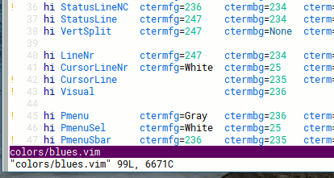

Blues colorscheme for Vim
--------------------------

Cool colors with VFD constants, sunny searches and
incandescent errors. Light bg support was added,
please set your preference.

Samples:  

Maintainer: Daniel Lima <danielmariodelima@gmail.com>  
License: MIT
